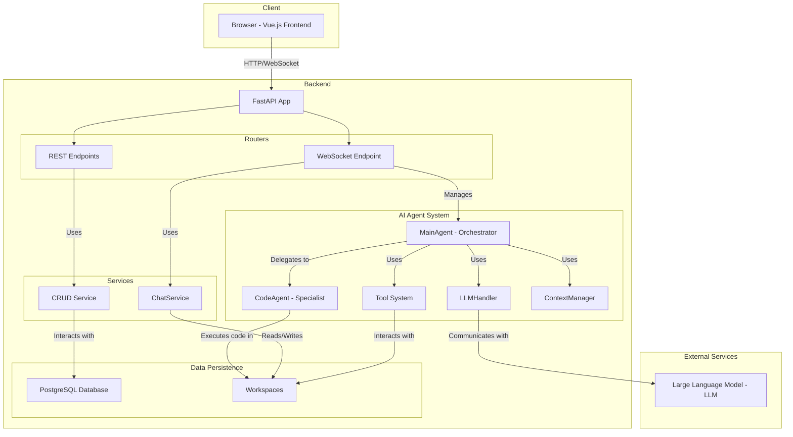

# Backend Architecture Documentation

This document provides a detailed overview of the backend architecture for the PaperAgent application.

## 1. High-Level Overview

The backend is a modern, asynchronous web service built with Python and FastAPI. It is designed to be a robust, scalable, and modular system that powers the AI-driven features of PaperAgent.

### Technology Stack

- **Framework**: **FastAPI** for high-performance, asynchronous API endpoints.
- **Database**: **PostgreSQL** for relational data storage, accessed via the **SQLAlchemy** ORM.
- **AI Integration**: **LiteLLM** to provide a unified interface to various large language models (LLMs).
- **Authentication**: **JWT (JSON Web Tokens)** for securing API endpoints.
- **Real-time Communication**: **WebSockets** for streaming AI responses and enabling interactive user sessions.
- **Code Execution Environment**: A sandboxed environment with common data science libraries (`pandas`, `numpy`, `matplotlib`) for executing AI-generated code.

### Core Architectural Principles

- **Asynchronous**: Built from the ground up with `async`/`await` to handle concurrent operations efficiently, which is crucial for managing long-running AI tasks and WebSocket connections.
- **Modularity**: The codebase is organized into distinct, decoupled modules with clear responsibilities (e.g., `routers`, `services`, `models`, `ai_system`).
- **Stateful Sessions**: The system manages stateful user sessions centered around a `Work`, each identified by a unique `work_id`. This allows the AI to maintain context and manage files for a specific task over an extended period.
- **Agent-Based AI**: The AI logic is structured around an agent-based model. A central orchestrator agent (`MainAgent`) delegates tasks to specialized agents and tools, separating high-level planning from low-level execution.

## 2. System Components

The architecture can be broken down into several key components:

### 2.1. API Layer (Routers)

The API layer is the entry point for all client requests. It is built using FastAPI's `APIRouter` to keep the endpoints organized.

- **WebSocket Endpoint (`/api/chat/ws/{work_id}`):** This is the primary communication channel for the interactive AI chat. It handles authentication, session management, and real-time streaming of AI-generated content (including text, tool calls, and final results).
- **REST Endpoints:** Standard RESTful endpoints are provided for auxiliary functions such as:
    - User authentication (`/api/auth`).
    - Managing paper templates (`/api/templates`).
    - CRUD operations for `Work` entities (`/api/works`).
    - Retrieving chat history (`/api/chat/work/{work_id}/history`).

### 2.2. Service Layer

The service layer contains the core business logic of the application, acting as a bridge between the API layer and the data layer.

- **`ChatService`**: Manages the persistence of chat conversations. It reads from and writes to JSON files on the filesystem, where each file corresponds to a specific `Work`.
- **`CRUD Service`**: Provides generic Create, Read, Update, and Delete operations for the database models.

### 2.3. AI Agent System (`ai_system`)

This is the most complex and critical part of the backend. It's responsible for all AI-related logic.

- **`MainAgent` (Orchestrator):** This is the "brain" of the system. It receives the user's prompt, maintains the conversation history, and decides the course of action. It does not execute tasks directly but delegates them by calling tools.
- **`CodeAgent` (Specialist):** A specialized agent that is invoked by the `MainAgent` to handle tasks requiring code execution, such as data analysis, mathematical calculations, or generating plots. It operates in a secure, isolated environment.
- **`LLMHandler`**: A wrapper around `LiteLLM` that manages the actual communication with the external language models. It handles streaming responses back to the caller.
- **Tool System**: A collection of functions that the `MainAgent` can call to interact with its environment. This includes tools for:
    - File I/O (`writemd`, `tree`).
    - Template manipulation (`update_section_content`, `analyze_template`).
    - Code execution (by invoking the `CodeAgent`).
- **`ContextManager`**: Manages the conversation history to ensure it stays within the LLM's context window limit. It uses summarization and compression techniques to condense older parts of the conversation.

### 2.4. Data Persistence Layer

The application uses a hybrid approach for data storage, leveraging both a relational database and the filesystem.

- **PostgreSQL Database**:
    - **Schema**: Defined in `models/models.py` using SQLAlchemy.
    - **Stores**: Core relational data such as `User` profiles, `Work` metadata, `PaperTemplate` information, and `ModelConfig` settings.
- **Filesystem (`pa_data/`)**:
    - **Workspaces (`pa_data/workspaces/{work_id}/`)**: Each `Work` has a dedicated directory on the filesystem. This directory acts as a sandboxed workspace for the AI, storing generated files, source code, images, and the final paper (`paper.md`).
    - **Chat History (`pa_data/chat_history/{work_id}.json`)**: Chat logs for each `Work` are stored as structured JSON files. This approach was chosen over a database to better handle the complex, nested structure of AI messages (which can include text, tool calls, and JSON blocks) and to improve performance for read/write operations on long conversations.
    - **Templates (`pa_data/templates/`)**: Stores the markdown files for paper templates.

## 3. Request Lifecycle (WebSocket Chat)

To illustrate how the components work together, here is the lifecycle of a typical user message sent via the chat interface:

1.  **Connection**: The frontend establishes a WebSocket connection to `/api/chat/ws/{work_id}`.
2.  **Authentication**: The client sends a JWT token, which the server validates. The server also verifies that the authenticated user has permission to access the specified `work_id`.
3.  **Message Reception**: The user sends a message (a prompt) over the WebSocket.
4.  **Agent Initialization**: The server instantiates the `MainAgent`, providing it with the `work_id` and the associated `template_id`. It also initializes the `ChatService`, `LLMHandler`, and `PersistentStreamManager`.
5.  **History Loading**: The `ChatService` loads the existing chat history from the corresponding JSON file, and this history is passed to the `MainAgent` to provide context.
6.  **Agent Execution**: The `MainAgent` receives the new user prompt. It appends the prompt to its conversation history and enters its execution loop:
    a. It sends the current conversation history to the LLM via the `LLMHandler`.
    b. The LLM responds with either a final answer or a request to call one or more tools.
    c. If the LLM requests a tool call (e.g., to run some Python code), the `MainAgent` invokes the appropriate tool (e.g., the `CodeAgent`). The output of the tool is then added to the conversation history.
    d. The process repeats (steps a-c) until the LLM provides a final answer and the task is complete.
7.  **Real-time Streaming**: Throughout the agent's execution, the `PersistentStreamManager` streams all events (LLM content, tool calls, status updates) back to the frontend in real-time over the WebSocket.
8.  **Persistence**: The `PersistentStreamManager`, in conjunction with the `ChatService`, saves the entire interaction (user prompt, AI responses, tool calls) to the chat history JSON file, ensuring the conversation is preserved.
9.  **Completion**: A final "complete" message is sent to the client, and the server awaits the next message.

## 4. Diagram

