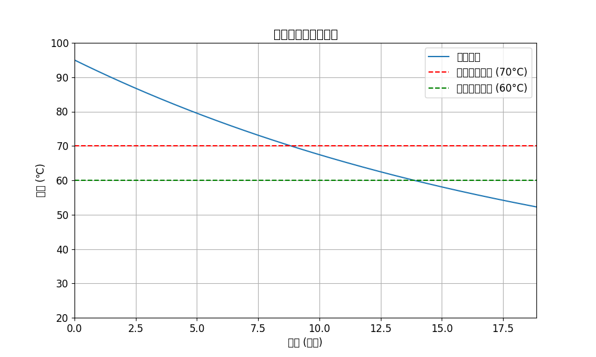

# 咖啡冷却分析报告

## 1. 问题描述

本报告旨在建立一个数学模型，确定办公室职员冲泡咖啡后的最佳饮用时机，并计算最佳饮用窗口的持续时间。

## 2. 数学模型

我们使用牛顿冷却定律来描述咖啡温度随时间的变化：

dT/dt = -k(T - T_env)

该微分方程的解为：

T(t) = T_env + (T₀ - T_env) * e^(-kt)

其中：

*   T(t) 是时间 t 的咖啡温度
*   T_env 是环境温度
*   k 是冷却系数
*   T₀ 是咖啡的初始温度

## 3. 参数设定

*   初始温度 (T₀): 95°C
*   环境温度 (T_env): 25°C
*   最佳饮用温度区间: 60°C - 70°C
*   冷却系数 (k): 0.05 (1/分钟)

## 4. 计算结果

根据上述模型和参数，我们计算得到以下结果：

*   开始饮用时间 (t_start): 8.84 分钟
*   结束饮用时间 (t_end): 13.86 分钟
*   最佳饮用窗口 (Δt): 5.03 分钟

## 5. 可视化分析

下图展示了咖啡温度随时间变化的曲线，以及最佳饮用温度区间：

## 6. 结论

根据我们的模型，该职员应在冲泡咖啡后约 8.84 分钟开始饮用，并在 13.86 分钟之前结束，以获得最佳口感。最佳饮用窗口持续约 5.03 分钟。

